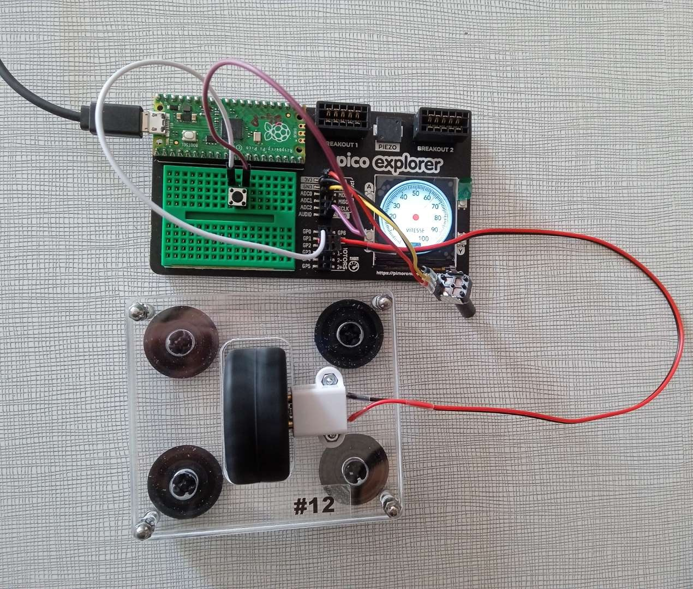

# En avant toute !
Ceci est un ensemble de liens et de sources

## Sommaire
 - [Bouton](#bouton)
 - [LED](#led)
 - [Écran](#écran)
 - [Moteur](#moteur)
 - [Sortie](#Sortie)
 - [Les bus](#les-bus)
 - [Time](#time)

## Télécharger les librairies
[Télécharger](https://github.com/adafruit/Adafruit_CircuitPython_Bundle/releases/download/20220614/adafruit-circuitpython-bundle-7.x-mpy-20220614.zip)


## Bouton
```python
import digitalio
import board

bouton = digitalio.DigitalInOut(board.GP4) # GP doit il faut choisir en fonction du cablage
bouton.direction = Direction.INPUT
bouton.pull = Pull.UP # ou bien Pull.DOWN

#Pour lire la valeur du bouton
#cela depend de la valeur du pull
# if bouton.value:
# if not bouton.value:
```

## Progress bar
https://docs.circuitpython.org/projects/progressbar/en/latest/

## Time
### Monotonic
```python
import time

#Exemple de d'utilisation, d'une attente non bloquante
delta = 2 #delay en seconde

while True:
    t = time.monotonic()
    if time.monotonic() - t > delta:
        ### l'action exucuté toute les 2 seconde

    ### l'action exucuté en continue
```
### Sleep
```python
import time

while True:
    ### l'action exucuté toute les 2 seconde
    time.sleep(2) ## delay de 2 seconde 
```

## Les bus

### Le bus I2C
```python
import board
import digitalio
import busio

# Création du bus I2C
busI2C = busio.I2C(scl=board.GP13, sda=board.GP12)


# il faut fournir le à l'ecran la connection avec le bus
# ici on prend l'accelerometer, cela peut être autre chose
accelerometer = adafruit_adxl34x.ADXL345(i2c)
```
### Le bus SPI
```python
import displayio
import busio

# Création du bus SPI
bus_spi = busio.SPI(clock = board.GP18, MOSI = board.GP19)

## il faut fournir le à l'ecran la connection avec le bus 
bus_affichage = displayio.FourWire(
                                    bus_spi,
                                    command = board.GP16,
                                    chip_select=board.GP17
                                    )
```

## LED
```python
import digitalio
import board

LED = digitalio.DigitalInOut(board.GP4) # il faut choisir le GP en fonction du cablage
LED.direction = digitalio.Direction.OUTPUT
LED.value = True # Pour allumer la led
LED.value = False # Pour éteindre la led
```

## Écran
Pour plus d'information: https://docs.circuitpython.org/projects/st7789/en/latest/

### code
```python
import displayio
import busio

# module externe, a importé le fichier
from adafruit_st7789 import ST7789

#Connection avec l'ecran
displayio.release_displays()
bus_spi = busio.SPI(clock = board.GP18, MOSI = board.GP19)
bus_affichage = displayio.FourWire(
                                    bus_spi,
                                    command = board.GP16,
                                    chip_select=board.GP17
                                    )

ecran = ST7789(bus_affichage, width=240, height=240, rowstart=80, rotation = 180)
groupe_elements = displayio.Group()
ecran.show(groupe_elements)
```
### Cablage
Aucun cablage n'est nécessaire 

### Insertion d'image
```python
#image
file = open('img/Indicateur_de_vitesse.bmp', "rb")
image = displayio.OnDiskBitmap(file)
grid = displayio.TileGrid(image, pixel_shader=displayio.ColorConverter())

#ajouter l'image sur l'ecran
groupe_elements.append(grid)
```
### Dessiner une forme géometrique 
Pour plus d'information: https://docs.circuitpython.org/projects/display-shapes/en/latest/api.html
```python
#ceci est un exemple, n'oublie pas de charger le ficher sur la pico ;)
from adafruit_display_shapes.circle import Circle

circle = Circle()#N'oublie pas les coordoonées x, y, le rayon et la couleur, exemple: Circle(100, 100, 10, fill=0xFF00FF)

#ajouter l'image sur l'ecran
groupe_elements = displayio.Group()
groupe_elements.append(grid)
```
## Sortie
### sortie PWM
```python
cp_out = pwmio.PWMOut(pin=board.GP3, frequency=100, duty_cycle=32700)
# Modification du rapport cyclique (ici 20%)
value = (50/100)*65535
cp_out.duty_cycle = int(value)
```


## Moteur
Pour plus d'information: https://docs.circuitpython.org/en/latest/shared-bindings/pwmio/index.html
```python
import pwmio
import board

mot1Moins = pwmio.PWMOut(board.GP9, frequency = 10000)
mot1Plus = pwmio.PWMOut(board.GP8, frequency = 10000)

# Le moteur, dont la valeur maximal est de 2**15
# mot1Moins est pour avancer et mot1Plus est pour reculer 
mot1Moins.duty_cycle = 0
mot1Plus.duty_cycle = 0
```



```python
import board
import busio
import digitalio
import time
import terminalio
import adafruit_adxl34x
from math import atan2,pi
import displayio
from adafruit_st7789 import ST7789
from adafruit_display_text import label
from adafruit_simplemath import map_range
from adafruit_display_shapes.rect import Rect

displayio.release_displays()

busI2C = busio.I2C(scl=board.GP21, sda=board.GP20)

accelerometer = adafruit_adxl34x.ADXL345(busI2C)

bus_spi = busio.SPI(clock=board.GP18, MOSI=board.GP19)
bus_affichage = displayio.FourWire(bus_spi, command=board.GP16,chip_select=board.GP17)
ecran = ST7789(bus_affichage, width=240, height=240, rowstart=80, rotation = 180 )

groupe_calibrage = displayio.Group()

fond_noir = open('Images/Calibration_fond.bmp', 'rb')
image1 = displayio.OnDiskBitmap(fond_noir)
fond_noir_bmp = displayio.TileGrid(image1, pixel_shader=displayio.ColorConverter())
groupe_calibrage.append(fond_noir_bmp)

texte = label.Label(terminalio.FONT, x=15, y=120, scale=2, text='offset en cours...', color=0xFFFFFF)
groupe_calibrage.append(texte)

ecran.show(groupe_calibrage)
accelerometer.offset = 0,0,0

def offset ():
    ax0 = []
    ay0 = []
    az0 = []
    for i in range(10):
        ax0.append(accelerometer.raw_x)
        ay0.append(accelerometer.raw_y)
        az0.append(accelerometer.raw_z)
        time.sleep(0.2)
    Xoffset = -round((sum(ax0)/(len(ax0)))/4.138)
    Yoffset = -round((sum(ay0)/(len(ay0)))/4.138)
    Zoffset = -round(((sum(az0)/len(az0)) - 256)/4)
    return Xoffset,Yoffset,Zoffset

accelerometer.offset = offset()

groupe_elements = displayio.Group()

roulis = label.Label(terminalio.FONT, x=15, y=120, scale=1, text='', color=0xFFFFFF)
groupe_elements.append(roulis)

tangage = label.Label(terminalio.FONT, x=15, y=140, scale=1, text='', color=0xFFFFFF)
groupe_elements.append(tangage)

bulleh = Rect(115, 193, 3, 30, outline=0x0, stroke=3, fill=0x0)
groupe_elements.append(bulleh)
bullhh = Rect(77, 193, 3, 30, outline=0x0, stroke=3, fill=0x0)
groupe_elements.append(bullhh)

bullev = Rect(193,115,30,3 , outline=0x0, stroke=3, fill=0x0)
groupe_elements.append(bullev)
bullvv = Rect(193,77 , 30,3 , outline=0x0, stroke=3, fill=0x0)
groupe_elements.append(bullvv)

ecran.show(groupe_elements)


while True:
    alpha = (atan2(accelerometer.raw_z,accelerometer.raw_y)/(2*pi))*360
    teta = (atan2(accelerometer.raw_z,accelerometer.raw_x))/(2*pi)*360
    if alpha >= 0:
        roulis.text = f"angle de roulis = {int(alpha)} degres"
        Bulle_V_bmp.y = int(map_range(alpha,180,0,20,140))
    if teta >= 0:
        tangage.text = f"angle de tangage = {int(teta)} degres"
        Bulle_H_bmp.x = int(map_range(teta,0,180,20,140))
    print(alpha,teta)
    time.sleep(0.1)

```
      
    
